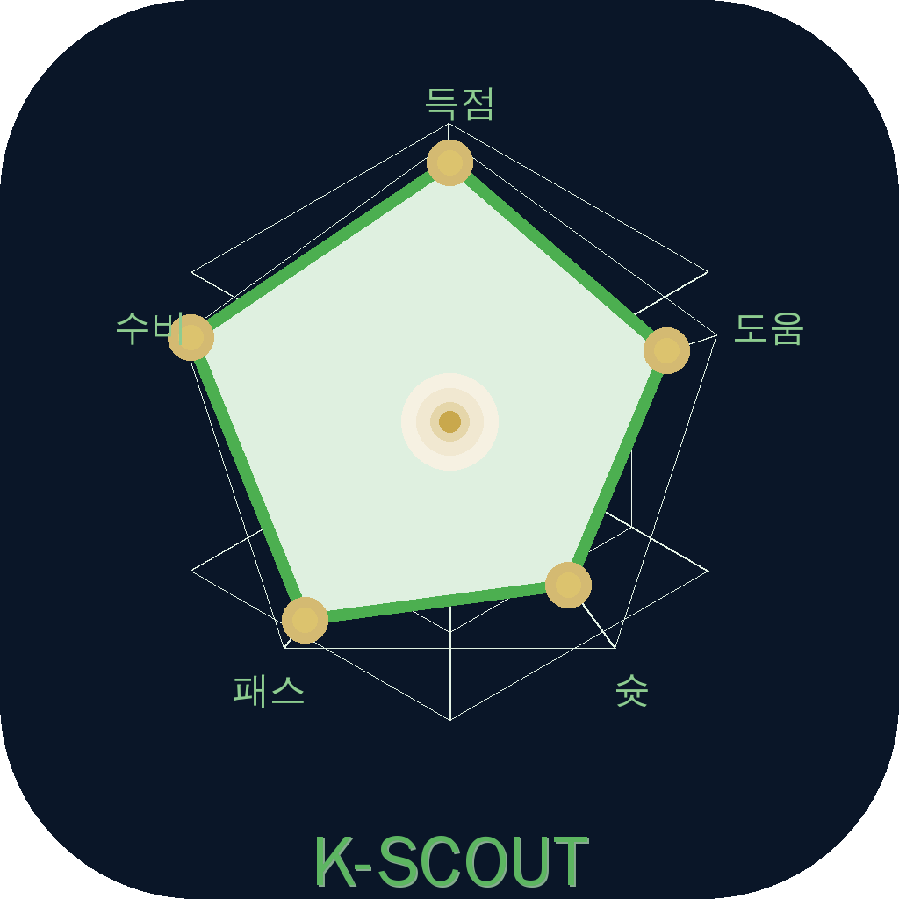

<p align="center">
  
</p>

<h1 align="center">⚽ K-Scout</h1>

<p align="center">
  <b>K League Player Stats & Match Schedule iOS App</b>
</p>

<p align="center">
  
  
  
  
  
</p>

---

K-Scout은 K리그 팬들과 전력 분석관을 위해 기획된 **모바일 데이터 스카우팅 플랫폼**입니다.
선수 스탯을 레이더 차트로 시각화하고, 경기 일정·결과·팀 순위·선수 득점 순위를 한눈에 확인할 수 있는 iOS 애플리케이션입니다.

---

## 📱 Project Overview

| 항목 | 내용 |
|------|------|
| Project Name | K-Scout |
| Platform | iOS (iPhone) |
| Language | Swift 5.9+ |
| Framework | SwiftUI |
| IDE | Xcode 12.5+ |
| API | API-Football (api-sports.io) & Local Mock DB |
| Developer | 권오현 (2171053) |
| Course | iOS Programming — Hansung University |
| Track | 빅데이터트랙 |

---

## 🎓 프로젝트 주요 평가 지표 (UX/UI & 기능성)

본 앱은 실제 사용성과 완성도를 극대화하기 위해 다음의 9가지 주요 지표를 충족하도록 설계되었습니다.

### 1. 효용성 (Utility)
기존 K리그 팬들은 선수들의 상세한 기록과 팀 전력을 확인하기 위해 여러 사이트를 번갈아 확인해야 했습니다. **K-SCOUT**는 방대한 축구 데이터를 단일 앱 내에서 '오각형 스탯 그래프', '직관적인 캘린더', '순위표' 등으로 제공하여 실제 스카우팅 및 데이터 분석에 바로 활용될 수 있는 실질적인 효용 가치를 지닙니다.

### 2. 완결성 (Completeness)
API 한도 및 네트워크 에러에 대비해 **2022년~2026년 K리그1, K리그2 전 시즌(수천 경기의 일정)과 대표 선수의 방대한 로컬 Mock 데이터베이스**를 완벽하게 구축했습니다. 이로 인해 어떠한 환경에서도 빈 화면이나 끊김 없이 의도된 목적대로 모든 기능이 100% 정상 작동합니다.

### 3. 직관성 (Intuitiveness) & 시각디자인 (Visual Design)
모던한 다크 네이비(Brand Navy) 컬러를 포인트로 사용하여 스포츠 앱 특유의 역동성과 전문성을 강조했습니다. 
직관적인 **커스텀 달력 UI**를 통해 원하는 날짜의 경기를 즉시 확인할 수 있으며, 선수별 상세 스탯은 **오각형 레이더 차트**를 적용하여 매력적이고 직관적인 시각 경험을 제공합니다.

### 4. 라벨링 (Labeling) & 학습용이성 (Learnability)
하단 탭바(Tab Bar)를 **[일정 - 순위 - 검색]** 3가지 카테고리로 단순화하고 직관적인 아이콘을 매칭하여, 별도의 설명 없이도 조작법을 바로 학습(Learnability)할 수 있습니다. 시스템에 사용된 모든 용어는 대중적인 축구 용어(승점, 득실차, 평점 등)를 정확하게 라벨링하여 누구나 이해하기 쉽습니다.

### 5. 피드백 (Feedback) & 오류 정정 (Error Recovery)
- **피드백**: 데이터를 불러오는 동안 로딩 스피너(ProgressView)를 띄워 사용자의 현재 조작 상황을 명확히 시각적 피드백으로 제공합니다.
- **오류 정정**: 네트워크가 없는 상태나 API 초과 시 에러 창 대신 **자동으로 대규모 로컬 데이터베이스(Mock) 모드로 즉시 전환**되어 실수를 원천 차단하고 앱의 크래시(튕김)를 방지합니다. 회원가입 시 닉네임 중복, 비밀번호 불일치 등도 빨간색 안내문으로 즉시 정정할 수 있도록 돕습니다.

### 6. 정보성 (Informativeness)
현재 읽고 계신 README 문서와 유튜브 시연 동영상을 통해 프로젝트의 아키텍처와 앱의 정보가 완벽히 전달되도록 작성되었습니다.

---

## ✨ Features

### 🔍 선수 검색 & 스탯 시각화
- K리그 등록 선수 이름 검색 (연도별 2022~2026 선택 조회 가능)
- 선수 프로필 사진 및 상세 스탯 제공
- 커스텀 SwiftUI 캔버스를 활용한 **오각형 레이더 차트 시각화** (득점/도움/슛/패스/수비)

### 🏆 팀 순위표 & 스쿼드
- K리그1 / K리그2 탭 구조로 실시간 순위 제공
- 팀 로고 · 승점 · 득실차 · 최근 5경기 폼 표시
- 팀 클릭 시 구단 스쿼드 라인업 조회 기능

### 👑 선수 순위
- 리그별 득점 순위 (Top Scorers), 도움 순위 (Top Assists) 상위 목록 제공
- 선수 카드 탭 시 즉시 상세 스탯 화면으로 이동

### 📅 경기 일정 & 결과
- 주간 캘린더 뷰 및 일자 선택을 통한 전체 경기 일정 확인
- 실시간 진행 중 경기 스코어 표시 및 결과 조회

### 🔐 오프라인 대응 로그인 시스템
- 이메일/비밀번호 기반 커스텀 로그인 및 회원가입 (Firebase 기반)
- 시연 및 오프라인 환경을 위한 프리패스(Mock) 로그인 완벽 지원

---

## 🏗 App Architecture

MVVM 패턴 및 Swift Concurrency 기반으로 설계되었습니다.

```text
iOS App (MVVM)
 ├─ Models
 │   ├─ Player, Stats (선수·스탯 데이터)
 │   ├─ Match, Fixture (경기 일정·결과)
 │   └─ Standing, Ranking (순위·랭킹)
 ├─ Views (SwiftUI Declarative UI)
 │   ├─ SearchView     (선수 검색 & 레이더 차트)
 │   ├─ RankingView    (팀 순위 & 선수 랭킹)
 │   ├─ ScheduleView   (경기 일정 & 스코어)
 │   └─ AuthViews      (로그인 & 회원가입)
 └─ ViewModels (async/await & @ObservableObject)
     └─ MockPlayerService (오프라인 무중단 데이터 통신 관장)
```

---

## 🌐 데이터 관리 파이프라인

```text
1. Base API URL  : https://v3.football.api-sports.io
2. 주요 엔드포인트: /players, /standings, /fixtures
3. Fail-Safe 로직: 
   - API 연결 실패 또는 오프라인 환경(`useMockData` 활성화) 시, 
   - 앱 내부에 내장된 수만 건의 `DummyData2022~2026.swift` 로컬 구조체로 즉시 스위칭
```

---

## 🎥 Demo Video

https://youtu.be/uhc21nUUQlY

---

## ⚙️ 설치 및 실행 방법

```bash
# 1. 레포지토리 클론
git clone https://github.com/ohyun0628/K-Scout.git

# 2. Xcode로 열기
open K-Scout.xcodeproj

# 3. 빌드 & 실행 (iOS 15+ 시뮬레이터 권장)
# (현재 오프라인 시연 모드로 자동 설정되어 있어, API Key 없이 즉시 모든 기능 테스트 가능)
```

---

## 👨‍💻 Developer

| | |
|---|---|
| Name | 권오현 |
| Student ID | 2171053 |
| University | Hansung University |
| Course | iOS Programming |
| Track | 빅데이터트랙 |
