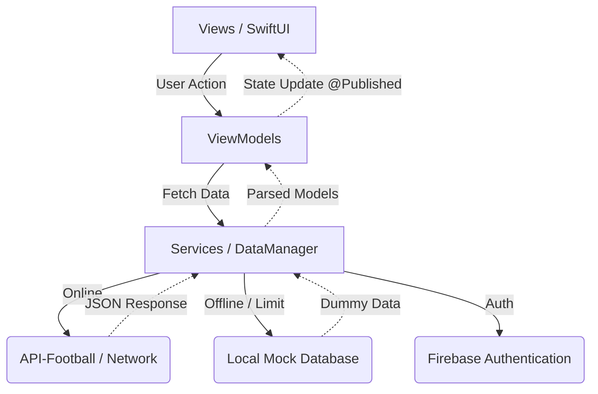

<p align="center">
  
</p>

<h1 align="center">⚽ K-Scout (K-스카우트)</h1>

<p align="center">
  <b>K리그 전력 분석 및 데이터 스카우팅 모바일 플랫폼</b><br/>
  "데이터로 K리그를 더 깊게, 더 넓게 봅니다."
</p>

<p align="center">
  
  
  
  
  
</p>

---

## 📖 About The Project

**K-Scout**은 기존의 K리그 팬들과 전력 분석관들이 여러 사이트를 번갈아 확인해야 했던 불편함을 해소하기 위해 기획된 **종합 K리그 데이터 스카우팅 iOS 애플리케이션**입니다.

해외 유수의 축구 통계 서비스에 뒤지지 않도록 **오각형 레이더 차트를 통한 스탯 시각화**, **과거 시즌의 데이터 복기**, **경기 세부 타임라인 및 라인업 제공** 등 심도 있는 분석 기능을 제공합니다. 네트워크 불안정성이나 API 트래픽 한계 상황에서도 사용자 경험을 해치지 않도록 **강력한 로컬 Fallback 시스템**을 구축한 것이 특징입니다.

<br/>

## 🎥 Demo Video

[](https://youtu.be/uhc21nUUQlY)
> 👆 이미지를 클릭하시면 앱 구동 시연 영상(YouTube)으로 이동합니다.

<br/>

## ✨ Key Features

### 🔍 다차원 선수 데이터 분석 (Player Analytics)
- **레이더 차트 시각화**: 선수의 강/약점(득점, 도움, 슛, 패스, 수비)을 SwiftUI 커스텀 캔버스로 그린 오각형 레이더 차트로 시각화
- **연도별 스탯 조회**: 2022년부터 2026년까지 선수의 시즌별 기록 비교 가능
- **선수 검색 및 즐겨찾기**: 특정 선수 검색 후 북마크 기능을 통해 마이페이지에서 모아보기 가능

### 🏆 리그 전체 순위 및 스쿼드 (League & Teams)
- **실시간 K리그1, 2 순위표**: 팀 로고, 승점, 득실차는 물론 최근 5경기 폼(W/D/L)을 시각적인 컬러 박스로 제공
- **구단별 상세 라인업 조회**: 순위표에서 구단 클릭 시 해당 시즌 스쿼드 정보 제공

### 📅 경기 일정 및 매치 프리뷰 (Fixtures & Preview)
- **무한 횡스크롤 커스텀 캘린더**: 원하는 날짜의 K리그 경기를 빠르고 직관적으로 탐색
- **매치 상세 타임라인**: 골, 어시스트, 카드, 교체 등의 주요 이벤트를 시간순으로 제공
- **전술 포메이션 뷰**: 양 팀의 선발 라인업을 실제 축구장 그래픽 위에 포메이션(ex. 4-4-2, 4-2-3-1)에 맞게 배치하여 시각화

### 🛡️ 견고한 하이브리드 오프라인 시스템 (Fail-Safe Architecture)
- **API 한도 초과 대응**: 네트워크 오류나 API Limit 도달 시 에러 팝업 대신 내장된 로컬 Mock Database로 즉시 전환(Seamless Fallback)
- **Firebase Auth 상태 유지**: 한 번 로그인하면 세션을 유지하는 자동 로그인 시스템 구현

<br/>

## 🏗 System Architecture

K-Scout는 **MVVM 아키텍처**와 **Swift Concurrency (async/await)**를 채택하여 UI와 비즈니스 로직을 완벽히 분리하고 비동기 처리의 안정성을 높였습니다.



### 🗂 Directory Structure
```text
KScout
 ├── App
 │   └── KScoutApp.swift         # 앱 엔트리 포인트 및 Firebase 초기화
 ├── Models                      # DTO 및 내부 데이터 모델
 │   ├── FixtureInfo.swift       # 경기 및 이벤트 모델
 │   ├── PlayerInfo.swift        # 선수 스탯 모델
 │   └── TeamInfo.swift          # 팀 순위 모델
 ├── ViewModels                  # 비즈니스 로직 및 상태 관리
 │   ├── MatchDetailViewModel.swift
 │   ├── RankingViewModel.swift
 │   └── SearchViewModel.swift
 ├── Views                       # UI 컴포넌트 및 화면
 │   ├── Auth/                   # 로그인, 회원가입 
 │   ├── Schedule/               # 일정 및 경기 상세 뷰 (축구장 그래픽)
 │   ├── Ranking/                # 팀 순위 및 폼 데이터 박스
 │   ├── Search/                 # 레이더 차트 및 검색 뷰
 │   └── MyPage/                 # 설정, 공지사항, 프로필 관리
 └── Services                    # 네트워크 및 데이터 처리
     ├── NetworkManager.swift    # API 통신 및 에러 핸들링
     └── MockPlayerService.swift # 오프라인 Mock 데이터 매니저
```

<br/>

## 🛠 Tech Stack

- **UI Framework**: `SwiftUI`
- **Architecture**: `MVVM` (Model-View-ViewModel)
- **Asynchronous**: `Swift Concurrency (async/await)`, `Combine` (일부 @StateObject)
- **Networking**: `URLSession` (REST API 통신)
- **Authentication**: `Firebase Auth` (이메일 로그인 지원)
- **API Provider**: `API-Football (api-sports.io)`
- **Version Control**: `Git` / `GitHub`

<br/>

## 🎨 Design System

**K-Scout**은 프로 축구 클럽의 다이나믹함을 표현하기 위해 명확한 컬러 시스템을 사용했습니다.

- **Primary Color (Brand Navy)**: 신뢰감을 주는 다크 네이비 (`#1A2B4C`)
- **Accent Color**: 승/무/패를 명확히 구분하는 직관적인 신호등 컬러 시스템 (승: `Green`, 무: `Gray`, 패: `Blue`)
- **Typography**: 가독성이 높은 시스템 폰트를 베이스로 하되, 스코어보드에는 `Monospaced` (고정폭) 폰트를 적용하여 숫자의 가독성을 극대화

<br/>

## ⚙️ Getting Started

### Prerequisites
- macOS 13.0+
- Xcode 14.0+ (iOS 15.0 이상 지원)
- 활성화된 인터넷 연결 (단, Mock Mode 사용 시 오프라인 구동 가능)

### Installation

```bash
# 1. 레포지토리 클론
$ git clone https://github.com/ohyun0628/K-Scout.git

# 2. 프로젝트 디렉토리 이동
$ cd K-Scout

# 3. Xcode로 프로젝트 열기
$ open KScout.xcodeproj
```
> **Note**: 현재 프로젝트는 평가자 및 시연 편의를 위해 `MockPlayerService`의 `useMockData`가 활성화되어 있습니다. 별도의 API 키 발급 없이 시뮬레이터에서 즉시 모든 기능을 테스트할 수 있습니다.

<br/>

## 👨‍💻 Developer & Contact

| 항목 | 내용 |
|:---:|:---|
| **이름** | 권오현 |
| **소속** | 한성대학교 컴퓨터공학부 빅데이터트랙 (학번: 2171053) |
| **과목** | iOS 프로그래밍 (캡스톤) |
| **GitHub** | [ohyun0628](https://github.com/ohyun0628) |
