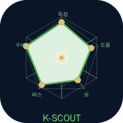

  

<h1 align="center">K-Scout</h1>

<b>K리그 경기·선수 데이터 분석 iOS 애플리케이션</b>

> **2026학년도 한성대학교 iOS 프로그래밍 수업 미니 프로젝트** 
> API-Football 데이터를 활용하여 K리그의 경기 일정, 실시간 정보 및 선수 스탯을 시각화하고 분석하는 SwiftUI 애플리케이션입니다.

---

## 📌 주요 기능 (Product Features)

### 1. 리그 순위표
* **실시간 업데이트:** K리그1 및 K리그2의 최신 순위 정보를 탭 구조로 제공합니다.
* **상세 정보:** 팀 로고, 승점, 득실차 및 순위 변동 상황을 직관적으로 표시합니다.

### 2. 경기 일정 및 스코어
* **주간 캘린더 뷰:** 주간 단위로 경기 일정을 한눈에 확인할 수 있습니다.
* **실시간 스코어:** 실시간으로 진행 중인 경기는 `LIVE` 배지와 함께 스코어가 업데이트됩니다.
* **킥오프 알림:** 관심 경기 시작 1시간 전에 Push 알림(`UserNotifications`)을 수신할 수 있습니다.

### 3. 팀·선수 스탯 비교
* **선수 검색:** K리그에서 활약 중인 선수들을 간편하게 검색하고 상세 프로필을 확인할 수 있습니다.
* **레이더 차트 시각화:** `SwiftUI Charts`를 활용하여 선수들의 핵심 스탯(득점, 도움, 슛, 패스, 수비)을 오각형 레이더 차트로 비교 분석(A 선수 vs B 선수)합니다.

---

## 🛠 기술 스택 (Tech Stack)

| 기술 | 역할 | 비고 |
| :--- | :--- | :--- |
| **Swift 5.9+** | iOS 앱 개발 언어 | Xcode 15+ |
| **SwiftUI** | 선언형 UI 프레임워크 | iOS 16+ |
| **async/await** | 비동기 네트워크 처리 | Swift Concurrency |
| **API-Football** | K리그 경기·순위·선수 데이터 수집 | 외부 REST API 활용 |
| **SwiftUI Charts** | 선수 스탯 레이더 차트 구현 | iOS 16+ 내장 프레임워크 |
| **UserNotifications** | 경기 시작 1시간 전 Push 알림 | Apple 공식 SDK |

---

## 🏗 시스템 아키텍처 (System Architecture)

본 프로젝트는 유지보수성과 테스트 용이성을 위해 **MVVM (Model-View-ViewModel) 패턴**을 기반으로 설계되었습니다.

* **Model:** API-Football로부터 받아오는 K리그 경기 데이터, 순위 데이터, 선수 스탯 데이터 구조 정의 (`Codable` 활용)
* **View:** SwiftUI를 활용한 선언형 UI 구성 및 3가지 핵심 화면(`리그 순위표`, `경기 일정`, `선수 스탯 비교`) 제공
* **ViewModel:** `async/await`를 통해 비동기적으로 네트워크 데이터를 요청하고, 뷰에 필요한 상태(State) 관리 및 비즈니스 로직 수행
